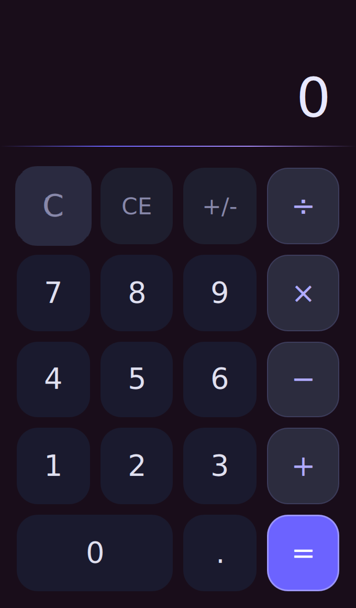
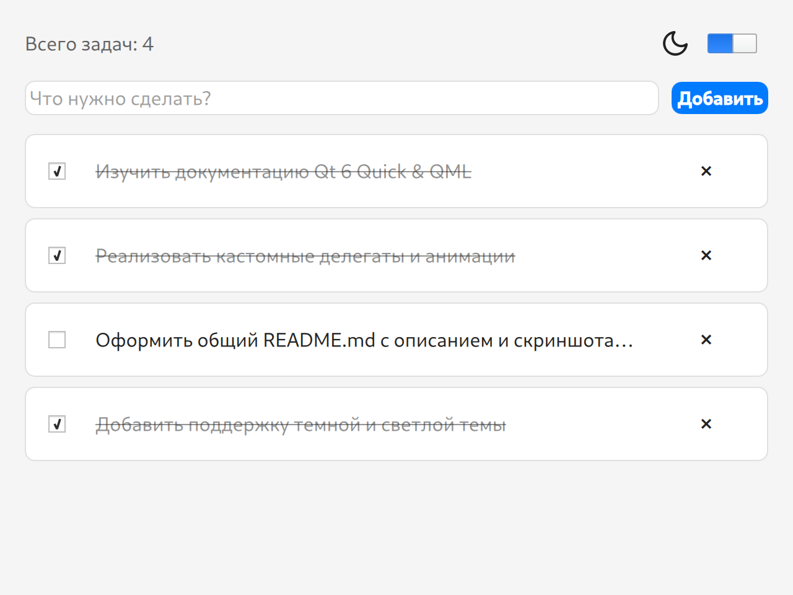
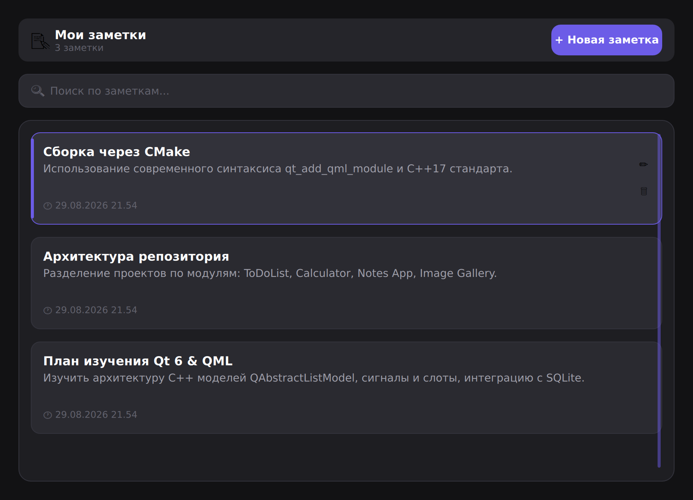
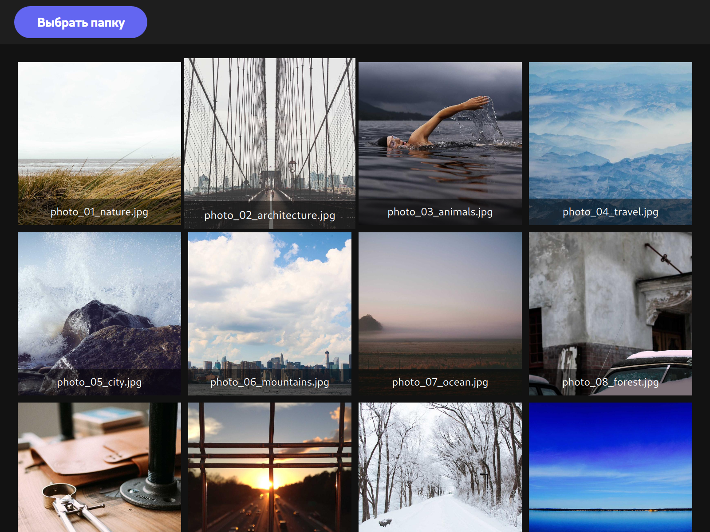

# 🌟 Qt 6 & QML Desktop Projects Showcase

Коллекция современных кроссплатформенных настольных приложений, разработанных на **C++17** и **Qt 6 (QML / Qt Quick)** с использованием современных практик проектирования интерфейсов и чистой архитектуры.


---

## 📑 Содержание

1. [Обзор проектов](#-проекты-в-репозитории)
   - [Калькулятор (Calculator)](#1-калькулятор-calculator)
   - [Список задач (To-Do List)](#2-список-задач-to-do-list)
   - [Заметки (Notes App)](#3-заметки-notes-app)
   - [Галерея изображений (Image Gallery)](#4-галерея-изображений-image-gallery)
2. [Структура репозитория](#-структура-репозитория)
3. [Системные требования](#-требования-к-окружению)
4. [Инструкция по сборке и запуску](#-инструкция-по-сборке-и-запуску)
   - [Сборка через терминал (CMake CLI)](#способ-1-сборка-через-терминал-cmake-cli)
   - [Сборка в Qt Creator](#способ-2-сборка-в-qt-creator)
   - [Сборка в VS Code / CLion](#способ-3-сборка-в-vs-code--clion)
5. [Архитектурные особенности](#-архитектурные-особенности)

---

## 🚀 Проекты в репозитории

### 1. Калькулятор (Calculator)

Стильный калькулятор с неоморфной темной темой, отзывчивой анимацией нажатий и надежным C++ вычислительным движком.

* **Архитектура:** C++ класс-бэкенд (`CalculatorBackend`), зарегистрированный в контексте QML.
* **Ключевые возможности:**
  * Базовые арифметические операции (`+`, `−`, `×`, `÷`).
  * Операции смены знака (`+/-`), полной очистки (`C`) и сброса ввода (`CE`).
  * Плавные анимации смены значений и подсветки активных операторов.

<div align="center">
  
</div>

---

### 2. Список задач (To-Do List)

Интерактивный менеджер задач с динамической поддержкой светлой и тёмной темы, реактивным списком и сохранением состояния в JSON.

* **Архитектура:** Наследник `QAbstractListModel` (`ToDoModel`) для эффективного рендеринга элементов в QML `ListView`.
* **Ключевые возможности:**
  * Быстрое добавление и удаление задач.
  * Чекбоксы с вычёркиванием выполненных пунктов.
  * Плавный переключатель темы оформления (Light/Dark mode) с цветовыми анимациями.
  * Автоматическое сохранение и загрузка задач из локального файла `tasks.json`.

<div align="center">
  
</div>

---

### 3. Заметки (Notes App)

Полнофункциональное приложение для управления персональными заметками с локальной базой данных **SQLite** и архитектурным паттерном **Repository**.

* **Архитектура:** 
  * Интерфейс репозитория `INoteRepository` и реализация `SqliteRepository` через `Qt SQL`.
  * Модель `NoteModel` (`QAbstractListModel`) для бесшовной связи с QML.
  * Глобальный синглтон дизайн-системы `Theme.qml`.
* **Ключевые возможности:**
  * Создание, просмотр, редактирование и удаление заметок.
  * Модальный диалог подтверждения удаления с анимацией.
  * Фильтрация и поиск по заметкам.
  * Персистентное хранение данных в SQLite (`~/.local/share/.../notes.db` / AppData).

<div align="center">
  
</div>

---

### 4. Галерея изображений (Image Gallery)

Быстрый просмотрщик каталогов с фотографиями и изображениями в виде адаптивной сетки.

* **Архитектура:** C++ модель `ImageGalleryModel` (`QAbstractListModel`), выполняющая сканирование выбранного каталога и фильтрацию форматов (`.png`, `.jpg`, `.jpeg`).
* **Ключевые возможности:**
  * Выбор любой локальной папки через диалог `FolderDialog`.
  * Динамическая сетка с кастомным делегатом карточки `ImageCardDelegate`.
  * Адаптивное масштабирование и отображение названий файлов.

<div align="center">
  
</div>

---

## 📁 Структура репозитория

```text
QtProjects/
├── Calculator/           # Приложение Калькулятор
│   ├── CMakeLists.txt
│   ├── main.cpp
│   ├── calculatorbackend.h / .cpp
│   ├── Main.qml
│   └── CalcButton.qml
│
├── ToDoList/             # Менеджер задач
│   ├── CMakeLists.txt
│   ├── src/              # C++ исходники (main.cpp, todomodel.h/.cpp)
│   └── qml/              # QML интерфейс и компоненты
│
├── Notes App/            # Приложение для заметок
│   ├── CMakeLists.txt
│   ├── main.cpp
│   ├── cpp/              # Модели данных и SqliteRepository
│   └── qml/              # Страницы, диалоги и Theme.qml
│
├── ImageGallery/         # Галерея изображений
│   ├── CMakeLists.txt
│   ├── main.cpp
│   ├── cpp/              # ImageGalleryModel
│   └── qml/              # Страницы и карточки миниатюр
│
├── docs/                 # Документация и скриншоты
│   └── screenshots/      # Скриншоты приложений для README
│
└── README.md             # Общее руководство по репозиторию
```

---

## 🛠 Требования к окружению

Для сборки любого из проектов потребуются:

1. **Компилятор C++ с поддержкой C++17**:
   * **Linux:** GCC 9+ или Clang 10+
   * **Windows:** MSVC 2019/2022 или MinGW 11.2+
   * **macOS:** Apple Clang / Xcode 12+
2. **CMake:** версия **3.16** или новее.
3. **Qt Framework:** версия **Qt 6.2+** (рекомендуется **Qt 6.5 LTS** или новее).
   * Необходимые модули: `Qt6Core`, `Qt6Gui`, `Qt6Qml`, `Qt6Quick`, `Qt6QuickControls2`, `Qt6Sql`.

> 💡 **Для пользователей Ubuntu / Debian:**
> ```bash
> sudo apt update
> sudo apt install build-essential cmake qt6-base-dev qt6-declarative-dev qml6-module-qtquick* libqt6sql6-sqlite
> ```

---

## ⚙️ Инструкция по сборке и запуску

Каждый проект в репозитории является независимым CMake-проектом и может быть собран отдельно.

### Способ 1: Сборка через терминал (CMake CLI)

Перейдите в директорию нужного проекта и выполните конфигурацию и сборку:

```bash
# 1. Перейдите в папку нужного проекта, например, Calculator:
cd "Calculator"

# 2. Сконфигурируйте проект с помощью CMake:
cmake -B build -S . -DCMAKE_BUILD_TYPE=Release

# 3. Скомпилируйте исполняемый файл:
cmake --build build --config Release

# 4. Запустите собранное приложение:
# На Linux / macOS:
./build/CalculatorApp
# На Windows:
.\build\Release\CalculatorApp.exe
```

#### Названия исполняемых файлов:
| Проект | Папка | Исполняемый файл |
| :--- | :--- | :--- |
| **Calculator** | `Calculator/` | `./build/CalculatorApp` |
| **To-Do List** | `ToDoList/` | `./build/ToDoListApp` |
| **Notes App** | `Notes App/` | `./build/appNotesApp` |
| **Image Gallery** | `ImageGallery/` | `./build/appImageGallery` |

---

### Способ 2: Сборка в Qt Creator

1. Запустите **Qt Creator**.
2. Выберите **File → Open File or Project...** (`Ctrl+O`).
3. Перейдите в папку нужного проекта и выберите соответствующий файл `CMakeLists.txt` (например, `Notes App/CMakeLists.txt`).
4. Выберите установленный комплект сборки (**Kit**), например **Desktop Qt 6.x.x (GCC/MSVC/Clang)**.
5. Нажмите кнопку **Configure Project**.
6. Нажмите **Run** (`Ctrl+R`) для сборки и запуска приложения.

---

### Способ 3: Сборка в VS Code / CLion

* **VS Code:** Установите расширения *CMake Tools* и *C/C++*. Откройте папку проекта, выберите нужный Qt Kit в статус-баре и нажмите `F5` / `Build`.
* **CLion:** Откройте корневой `CMakeLists.txt` проекта. CLion автоматически распознает Qt 6 модуль и предложит запустить конфигурацию.

---

## 🏛 Архитектурные особенности

* **Строгое разделение ответственности (Separation of Concerns):**
  * **C++ слой:** Управляет сложными вычислениями, файловым вводом/выводом, базой данных SQLite и бизнес-правилами.
  * **QML слой:** Отвечает исключительно за декларативный рендеринг интерфейса, анимации, плавные переходы и темы оформления.
* **Современный синтаксис модулей `qt_add_qml_module`:**
  * Проекты используют декларативный механизм сборки Qt 6 с типобезопасной статической регистрацией типов и компиляцией QML в C++ байт-код.
* **Паттерн Repository:**
  * Использование интерфейсов (например, `INoteRepository`) позволяет легко подменять хранилище данных (SQLite, файлы, сеть) без изменения логики моделей и UI.
* **Централизованные дизайн-системы:**
  * Цветовые токены, отступы и шрифты вынесены в QML-синглтоны (`Theme.qml` / `Style.qml`), что упрощает поддержку тем оформления и единообразие интерфейса.
